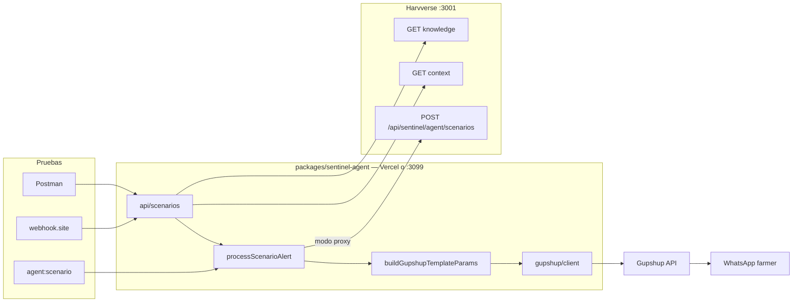

# Arquitectura — Sentinel Agent (Gupshup)

## Vista general



## Módulos activos

| Módulo | Responsabilidad |
|--------|-----------------|
| `src/types/agent-scenario.ts` | Contrato Zod escenarios Harvverse |
| `src/clients/harvverse-agent.ts` | HTTP al backend (header `x-sentinel-agent-key`) |
| `src/agent/process-scenario.ts` | Inline vs proxy → envío Gupshup |
| `src/agent/build-gupshup-params.ts` | 7 variables template `harvverse_sentinel_alert` |
| `src/channels/gupshup/` | Cliente template/msg + dry-run + `requestPreview` |
| `api/*.ts` | Rutas serverless Vercel / servidor local |

## Modos de operación

| Modo | Condición | Resultado |
|------|-----------|-----------|
| `inline` | Body con `context` + `whatsapp` | Sin llamar Harvverse |
| `harvverse` | Body `{ lotCode, scenario }` | Fetch scenario luego Gupshup |
| `gupshup-dry-run` | Sin credenciales o `?dryRun=1` | JSON + `requestPreview`, sin POST real |
| `gupshup-live` | `GUPSHUP_*` + template ID | POST a `api.gupshup.io` |

## Eliminado (no usar)

- Meta WhatsApp Cloud API (`graph.facebook.com`)
- `processSentinelAlert` / eventos `copernicus.snapshot.created` en este paquete
- AI SDK tools en esta fase (vuelven si se refina param 7 con LLM)

## API pública npm

```typescript
export { processScenarioAlert, buildGupshupTemplateParams, sendGupshupTemplate };
```
